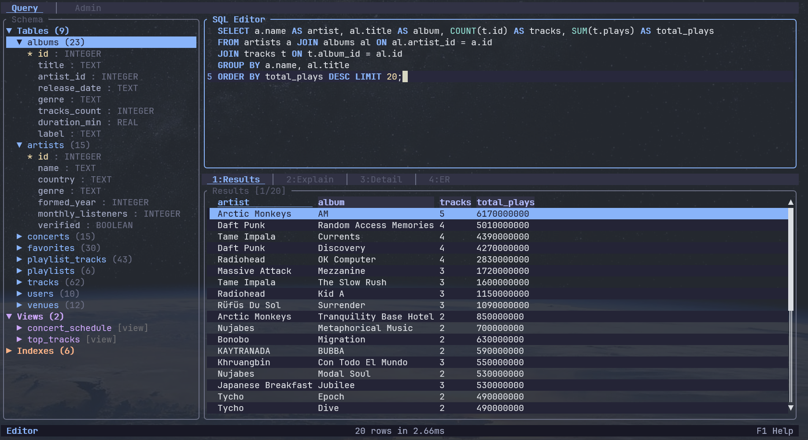
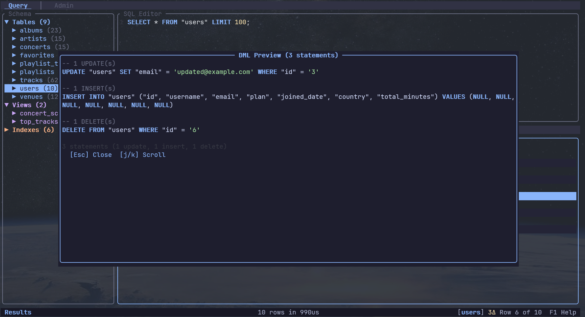
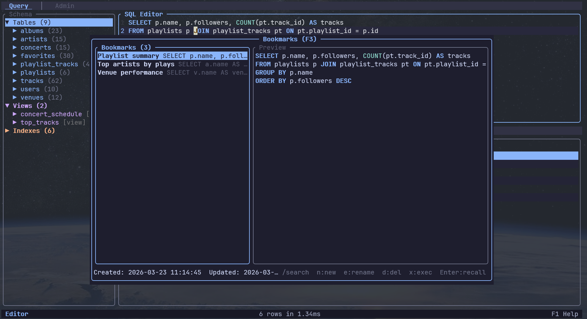
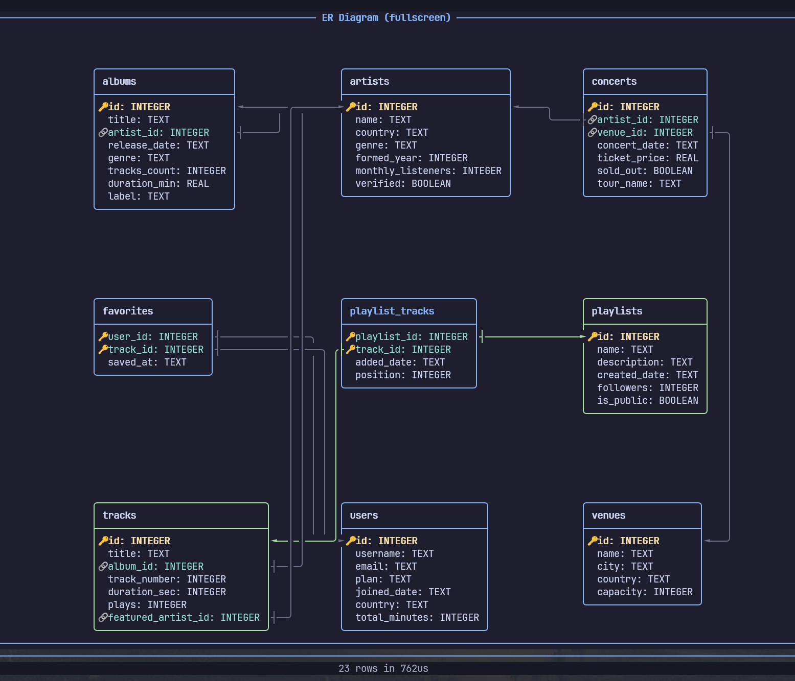

<p align="center">
  
</p>

<p align="center">
  A keyboard-driven terminal UI for browsing, querying, and administering Turso and SQLite databases.
  <br>
  Built with Rust, <a href="https://ratatui.rs">ratatui</a>, and vim-inspired navigation.
</p>

## Demo

<p align="center">
  <a href="https://youtu.be/bo3zhI8sRZY">
    
  </a>
  <br>
  <em>Click the image to watch the demo on YouTube</em>
</p>

## Screenshots

<p align="center">
  
  <br>
  <em>Schema browser with row counts, SQL editor with syntax highlighting, and sortable results table</em>
</p>

<p align="center">
  
  <br>
  <em>DML Preview — review generated INSERT, UPDATE, and DELETE statements before committing</em>
</p>

<p align="center">
  
  <br>
  <em>Saved Bookmarks — name, search, and recall frequently-used queries</em>
</p>

<p align="center">
  
  <br>
  <em>ER Diagram — visual entity-relationship view with FK edges, PK/FK markers, and cycle detection</em>
</p>

## Features

**Multi-Database Tabs** — open multiple databases simultaneously with a tab bar. Switch between them with `Ctrl+PgDn`/`Ctrl+PgUp`, open new databases with `Ctrl+O` file picker, close with `Ctrl+W`. Each database has independent schema, editor, and results state.

**Schema Browser** — color-coded tree view of tables, views, indexes, triggers, and columns with inline search filtering, async row counts, and DDL viewing. Each entity type has a distinct color for quick visual scanning.

**SQL Editor** — syntax-highlighted editor with undo/redo, text selection, auto-save, active line highlighting, and statement-at-cursor execution.

**Schema-Aware Autocomplete** — context-sensitive completions for table names, columns, SQL keywords, and qualified references with alias resolution.

**Results Table** — sortable, resizable columns with alternating row colors, cell/row clipboard copy, JSON pretty-printing, and configurable NULL display.

**Inline Data Editor** — edit table data directly in the results view. Add, modify, and delete rows with full change tracking. Preview generated DML (INSERT/UPDATE/DELETE) before committing. Transactional submission with automatic rollback on failure.

**Foreign Key Navigation** — follow FK references from any cell to the referenced row. Breadcrumb trail with back-navigation to retrace your path through related tables.

**Record Detail** — vertical key-value view for inspecting a single row across all columns, with JSON syntax coloring for structured values.

**ER Diagram** — visual entity-relationship diagram built from foreign key definitions. Grid layout with box-drawing borders, PK/FK markers, relationship edges, cycle detection with dashed lines, and adjustable spacing.

**Go to Object** — fuzzy search across all open databases (`Ctrl+P`). Instantly navigate to any table, view, index, trigger, or column with ranked results.

**EXPLAIN View** — bytecode table and query plan tree, toggled with a single key.

**Export** — save results as CSV, JSON, or SQL INSERT statements to file or clipboard. Quick TSV copy with a shortcut.

**Saved Bookmarks** — name and save frequently-used queries (`F3`). Database-scoped with search, rename, delete, and one-key recall or execute. Backed by SQLite for persistence across sessions.

**Quick Table Filter** — press `w` on the results panel to type a WHERE clause and instantly filter table data without touching the editor. Two-phase dismiss (defocus then clear).

**DDL Viewer** — press `Shift+D` on any schema object to view its full CREATE statement with syntax highlighting, scrolling, and clipboard copy.

**Query History** — SQLite-backed per-database history with search, recall, re-execute, and auto-prune.

**Admin Tab** — database info (file stats, WAL status, journal mode), PRAGMA dashboard with inline editing, WAL checkpoint, and integrity checks.

**Theming** — Catppuccin Mocha (dark) and Catppuccin Latte (light) themes with rounded borders, toggled at runtime.

## Turso Compatibility

tursotui is **Turso-first** — all features are tested and designed to work within Turso's compatibility surface. It also works with standard SQLite databases.

**Turso-aware highlights:**

- Schema introspection uses Turso-compatible PRAGMAs (`table_info`, `index_list`, etc.)
- Foreign key metadata parsed from `CREATE TABLE` SQL (works around Turso's missing `PRAGMA foreign_key_list`)
- Syntax highlighting and autocomplete include Turso-specific functions: UUID (`uuid4()`, `uuid7()`), vector search (`vector_distance_cos()`, `vector_top_k()`), FTS (`fts_match()`, `fts_score()`), time functions, regexp, and more
- DB Info panel recognizes MVCC journal mode with Turso-specific labeling
- Data editor uses `PRAGMA defer_foreign_keys` inside transactions for safe FK handling

**Known Turso limitations** (not tursotui bugs — these are upstream gaps):

- No `RIGHT JOIN`, `CROSS JOIN`, or ranking window functions (`ROW_NUMBER`, `RANK`, etc.)
- No `SAVEPOINT`/`RELEASE`, `VACUUM`, `REINDEX`, `GENERATED` columns, or recursive CTEs
- Views and Triggers are experimental features requiring enablement flags
- FTS uses different syntax than SQLite FTS5 (`fts_match()` instead of `MATCH`)

See [COMPAT.md](https://github.com/tursodatabase/turso/blob/main/COMPAT.md) for the full Turso compatibility matrix.

## Installation

### From source

Requires [Rust](https://rustup.rs/) (edition 2024, Rust 1.85+).

```sh
git clone https://github.com/mikeleppane/tursotui.git
cd tursotui
cargo build --release
```

The binary is at `target/release/tursotui`.

## Usage

```sh
# Open a SQLite/Turso database file
tursotui mydb.sqlite

# Open an in-memory database
tursotui

# Open multiple databases in tabs
tursotui db1.sqlite db2.sqlite
```

## Keybindings

### Global

| Key | Action |
|-----|--------|
| `Ctrl+Q` | Quit |
| `Ctrl+Tab` | Cycle focus between panels |
| `Ctrl+B` | Toggle schema sidebar |
| `Alt+1` / `Alt+2` | Switch Query / Admin tab |
| `Ctrl+T` | Toggle dark/light theme |
| `F1` / `?` | Help overlay |
| `Ctrl+O` | Open database file |
| `Ctrl+P` | Go to Object (fuzzy search) |
| `Ctrl+PgDn` / `Ctrl+PgUp` | Next / previous database tab |
| `Ctrl+W` | Close current database tab |
| `Ctrl+Left` / `Ctrl+Right` | Resize sidebar (narrower / wider) |
| `Ctrl+Up` / `Ctrl+Down` | Resize editor (shorter / taller) |
| `F3` | Bookmarks overlay |
| `Ctrl+Shift+E` | Export results |
| `Ctrl+Shift+C` | Quick copy results (TSV) |

### Query Editor

| Key | Action |
|-----|--------|
| `F5` / `Ctrl+Enter` | Execute query |
| `Ctrl+Shift+Enter` | Execute selection or statement at cursor |
| `Ctrl+Space` | Trigger autocomplete |
| `Tab` | Accept completion |
| `Ctrl+Z` / `Ctrl+Y` | Undo / Redo |
| `Ctrl+L` | Clear buffer |
| `Ctrl+H` | Query history |
| `Shift+Arrow` | Extend selection |
| `Ctrl+Shift+A` | Select all |

### Schema Explorer

| Key | Action |
|-----|--------|
| `j` / `k` | Navigate up/down |
| `Enter` / `Space` / `l` | Expand / collapse |
| `h` | Collapse / go to parent |
| `o` | Query table (`SELECT *`) |
| `Shift+D` | View DDL (CREATE statement) |
| `/` | Filter by name |

### Results Table

| Key | Action |
|-----|--------|
| `j` / `k` | Navigate rows |
| `h` / `l` | Navigate columns |
| `g` / `G` | First / last row |
| `s` | Cycle sort on column |
| `<` / `>` | Shrink / grow column |
| `w` | WHERE filter bar |
| `y` | Copy cell |
| `Y` | Copy row |

### Data Editor (when results are editable)

| Key | Action |
|-----|--------|
| `e` / `F2` | Edit current cell |
| `Enter` | Confirm cell edit |
| `Esc` | Cancel cell edit |
| `Ctrl+N` | Set cell to NULL |
| `Ctrl+Enter` / `F10` | Confirm modal edit |
| `a` | Add new row |
| `d` | Toggle delete mark |
| `c` | Clone row |
| `u` / `U` | Revert cell / row |
| `Ctrl+U` | Revert all changes |
| `Ctrl+D` | Preview DML |
| `Ctrl+S` | Submit changes |
| `f` | Follow FK reference |
| `Alt+Left` | FK back-navigation |

### Bottom Panels

| Key | Action |
|-----|--------|
| `1` / `2` / `3` / `4` | Results / Explain / Detail / ER Diagram |
| `Tab` (Explain) | Toggle Bytecode / Query Plan |
| `Enter` (Explain) | Generate EXPLAIN |
| `Tab` (ER Diagram) | Cycle focus between tables |
| `Enter` (ER Diagram) | Expand / collapse table columns |
| `h/j/k/l` (ER Diagram) | Pan viewport |
| `+` / `-` (ER Diagram) | Adjust spacing |
| `c` (ER Diagram) | Toggle compact mode |
| `o` (ER Diagram) | Query focused table |

### Admin Tab

| Key | Action |
|-----|--------|
| `r` | Refresh |
| `c` | WAL checkpoint |
| `i` | Integrity check |
| `Enter` (Pragmas) | Edit selected pragma |

Press `Esc` in any panel to release focus.

## Configuration

Config file location: `~/.config/tursotui/config.toml`

```toml
[editor]
tab_size = 4
autocomplete = true
autocomplete_min_chars = 1

[results]
max_column_width = 40
null_display = "NULL"

[history]
max_entries = 5000

[theme]
mode = "dark"    # "dark" or "light"
```

## Architecture

- **Unidirectional data flow** — components emit `Action`s, `AppState` processes state changes, results route back to components via two-phase dispatch.
- **Async queries** — `tokio::spawn` with fresh connections per query, results delivered via `mpsc` channel.
- **Component trait** — each panel implements `handle_key`, `update`, `render` with consistent `panel_block` / `overlay_block` helpers for styled borders.
- **Catppuccin theme system** — full Mocha (dark) and Latte (light) palettes with semantic color roles for schema types, editor highlighting, and data editing states.
- **Transactional data editing** — change log with one-entry-per-PK invariant, DML generation, and `PRAGMA defer_foreign_keys` for safe FK handling.
- **No unsafe code** — `#[forbid(unsafe_code)]` enforced project-wide.

## Tech Stack

| Crate | Purpose |
|-------|---------|
| [turso](https://crates.io/crates/turso) | Database engine (libSQL/SQLite) |
| [ratatui](https://crates.io/crates/ratatui) | Terminal UI framework |
| [tokio](https://crates.io/crates/tokio) | Async runtime |
| [clap](https://crates.io/crates/clap) | CLI argument parsing |
| [arboard](https://crates.io/crates/arboard) | Clipboard access |
| [unicode-width](https://crates.io/crates/unicode-width) | Display-column width measurement |
| [serde](https://crates.io/crates/serde) / [toml](https://crates.io/crates/toml) | Configuration serialization |
| [dirs](https://crates.io/crates/dirs) | Platform config/data directories |

## License

MIT

---

## Acknowledgments

- Built with [Rust](https://www.rust-lang.org/)
- TUI powered by [ratatui](https://ratatui.rs)
- Cross-platform terminal handling by [crossterm](https://github.com/crossterm-rs/crossterm)

---

## Contact

**Author:** Mikko Leppänen
**Email:** mleppan23@gmail.com
**GitHub:** [@mikeleppane](https://github.com/mikeleppane)

---

<p align="center">Written with ❤️ in Rust & built with Ratatui</p>
